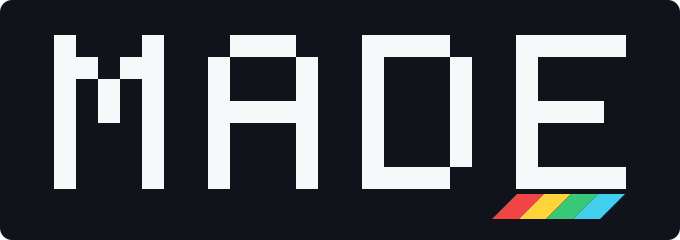

<h1 align="center">MADE — Structured work for your agents</h1>
<p align="center"></p>
<p align="center"><strong>Multi-Agent Deliberation Engine · by Underpass</strong></p>

MADE coordinates a shared procedure: who can act, which work is ready, what
needs review and when a person must decide. Your host supplies the agents,
tools and people. MADE validates their progress and records the accepted
results in an auditable ceremony event stream.

The default path is local: a plugin, an MCP process and SQLite. No MADE
account, deployed service, Docker or Kubernetes is needed. Rust applications
can embed the same engine. A separate service distribution supports gRPC,
provider-backed councils and Kubernetes.

## Start locally

Install the current published binary with Cargo:

```bash
cargo install made-mcp --locked
mkdir -p "$HOME/.local/state/underpass-made"
MADE_MCP_BACKEND=embedded \
MADE_MCP_STORE_PATH="$HOME/.local/state/underpass-made/ceremonies.sqlite3" \
  made-mcp
```

`made-mcp` speaks MCP over stdio; register that command and environment in
your host using the [local setup guide](docs/embedded/README.md). Checksummed
[release binaries](https://github.com/underpass-ai/made/releases) avoid the
Rust toolchain. To embed the engine in Rust, start with the
[complete library example](docs/embedded/rust.md).

The plugin adds installation, design and execution skills. **The stable
`marketplace` branch still carries v0.5.0's old `underpass` catalogue identity;
it does not yet support `made@made`.** Use the binary route above today, or
register a local checkout containing the repaired `made` catalogue:

```bash
codex plugin marketplace add /absolute/path/to/made
codex plugin add made@made
```

Run `made-setup` and start a new task. The
[plugin guide](docs/plugins/README.md) covers obtaining that checkout, Claude
Code and the native Windows launcher. Once a later release publishes the
repaired catalogue and advances `marketplace`, the stable Codex route will be:

```bash
codex plugin marketplace add underpass-ai/made --ref marketplace
codex plugin add made@made
```

## Give the host a procedure

> Design a change review: an author proposes a solution, a reviewer challenges
> it, and I approve the final result.

Design produces a draft. Publish its reviewed definition, then start a
session from that published name and version so it can resume after restart.
For each delegated step, the host claims the work, performs it and submits
its output. A claim alone performs nothing. The default no-op handler proves
engine wiring, not that external work happened.

Ceremonies can declare sequential or concurrent work, role eligibility,
human guards, retry policies, bounded repetition, transition budgets and
context writes. Hosts schedule the workers; MADE does not automatically
spawn agents or implement every multi-agent orchestration pattern.

## Pick your path

| Need | Start here |
|:--|:--|
| Use MADE through a coding agent | [Plugin](docs/plugins/README.md) · [Manual MCP setup](docs/embedded/README.md) |
| Put the engine inside a Rust application | [Embedding](docs/embedded/rust.md) |
| Design a reusable procedure | [Ceremony authoring](docs/authoring/README.md) |
| Execute, resume or inspect a session | [Runtime contract](docs/runtime/README.md) |
| Operate a shared service | [Kubernetes](docs/operations/deploy-kubernetes.md) |
| Build or extend MADE | [Architecture](docs/architecture/README.md) · [Development](docs/development/README.md) |

MADE is pre-1.0. These pages describe this source tree and explicitly mark
hardening that is not in v0.5.0. Use the running server's `tools/list` and
`made_discover_capabilities` to check the installed surface. See
[migrations](docs/migrations/README.md), [release history](CHANGELOG.md) and
[documentation home](docs/index.md).

[Apache-2.0](LICENSE). Copyright © 2026 Tirso García Ibáñez.
Part of [Underpass AI](https://underpassai.com).
