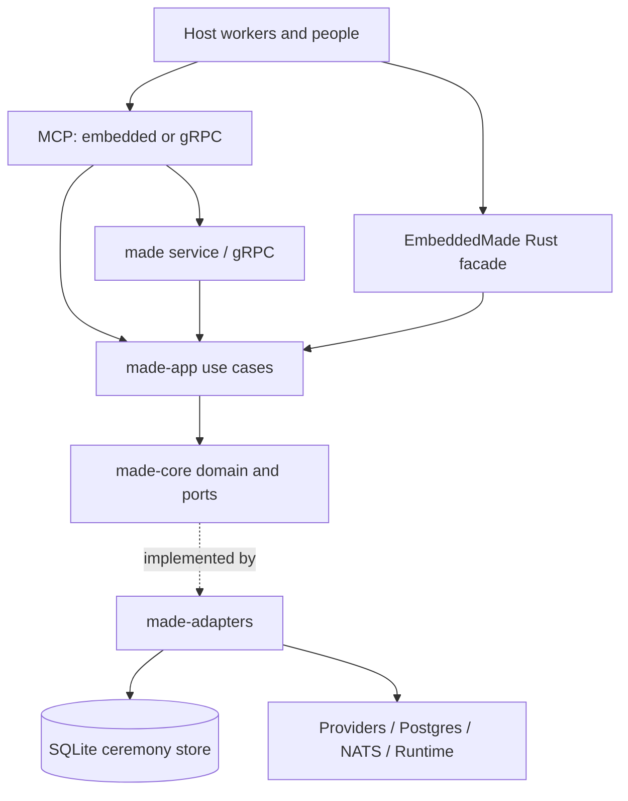

# Architecture

MADE has one ceremony engine and several entrypoints. Transport adapters map
requests into application use cases; those use cases ask domain aggregates
to make decisions and persist the resulting events through ports.

The service is a composition root, not a second domain model. The embedded
composition opens no sockets by default and has no dependency on the
service's external systems. MADE session memory is its own bounded context;
KMP is not a prerequisite or an internal dependency.

## Ownership

| Package | Responsibility |
|:--|:--|
| `made-core` | Aggregates, typed values, events, invariants and ports |
| `made-app` | Use-case orchestration over domain ports |
| `made-adapters` | SQLite, YAML, gRPC, providers, messaging and concrete integrations |
| `made-api` | Small consumer-facing Rust trait, views, capabilities and errors |
| `made-embedded` | Local composition and host callbacks |
| `made-proto`, `made-mcp-proto` | Generated bindings from the same protobuf contract |
| `made-mcp` | Stdio protocol, backend selection and executable capability/help catalogue |
| `made` | Service configuration, gRPC/HTTP lifecycle and deployed composition |

Core has no transport or provider vocabulary. Application code depends on
ports rather than concrete adapters. DTOs and encoding belong at boundaries;
typed values carry domain constraints. Production types have focused files.
The [architecture gate](../../scripts/ci/architecture-gate.sh) enforces the
checked [conformance ledger](conformance.tsv); remaining exceptions are
explicit, not permission to expand them.

## Events are authoritative

A ceremony is reconstructed from its sealed event stream. Commands load its
state, validate a decision and append against an expected stream version.
Accepted events update projections: snapshots, transcripts, session memory,
metrics and publication. A snapshot is a cache, not a competing truth.
Published definition identity is part of restart recovery.

A session stream version and a global feed position answer different
questions. Cursor leases and acknowledgements govern delivery, while step
leases govern execution. The NATS adapter uses core pub/sub; enabling
JetStream on a broker does not create an end-to-end delivery guarantee in
MADE. Consumers use the durable feed/cursor contract where required.

A verified journal establishes internal integrity and ordering. It does not
prove that an external tool's result was accurate or that a declared actor
was authenticated. The host owns those boundaries.

## Current hardening contracts

Completion fencing and durable visits are unreleased after v0.5.0. A
`StepClaimFence` identifies the accepted lease and its execution coordinates;
it must include the visit when the two hardening changes are integrated.
Application-owned execution carries the accepted fence through handler and
completion retries. It never reloads a newer claim to accept old work.

`StateVisit` is a positive ceremony-wide entry ordinal, distinct from
`StateIteration`, step iteration and attempt. Initial entry is visit 1;
each new transition, including self-transitions and terminal entry, increments
it. Within-state repetition retains the visit and consumes no transition
budget.

A new transition seals the destination visit and exact destination step ids.
Folding archives executed destination records, then resets listed records to
pending at the new visit with state iteration, step iteration and attempt 1.
It needs no current definition to infer that reset. Context, human decisions,
participant bindings and interventions retain their ceremony scope; entering
a state does not revoke earlier approvals.

Old transitions without this payload keep the old fold. Absent historical
visit fields remain absent on serialization, preserving sealed bytes and
hashes. A new transition after an old prefix opens visit 2; no undocumented
historical visits are reconstructed. See [migration versions](../migrations/README.md).

## Public contract discipline

The [parity ledger](parity.tsv) maps capabilities to protobuf, both MCP
backends, the embedded facade and the narrower API trait. Tests compare the
ledger with real methods and catalogues. The
[support matrix](../operations/support-matrix.md) is checked against that same
ledger; cross-backend sessions compare shared behavior, not only method names.

The [numeric conversion ledger](struct-numbers.tsv) specifies JSON/protobuf
number rules. [Coverage floors](coverage-floors.tsv) and conformance rows are
machine inputs kept at stable paths. A documentation cleanup must not delete
or silently reinterpret them.

## Decision history

This narrative supersedes the previous architecture prose as the active
entrypoint. The historical ADRs remain available in the
[archived ADR index](../history/pre-rebuild-2026-09-18/docs/adr/README.md).
In particular, ADRs 001/013 explain domain and memory boundaries, 004 the
consumer API, 012 the event-stream foundation, 014 the local distribution and
parity, and 015/016 concurrency and bounded primitives. Historical plans can
explain a decision; current code, tests and the runtime catalogue establish
what is implemented.
