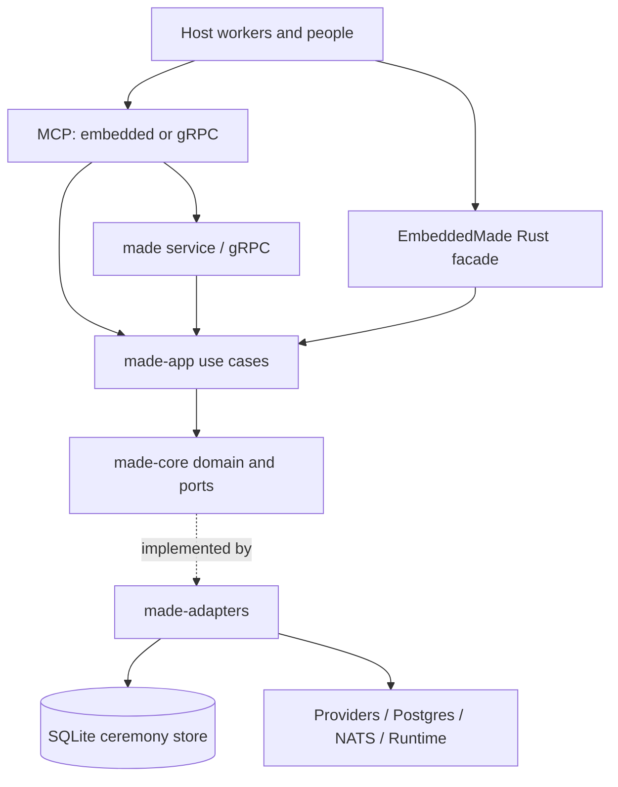

# Architecture

MADE has one ceremony engine and several entrypoints. Transport adapters map
requests into application use cases; those use cases ask domain aggregates
to make decisions and persist the resulting events through ports.

The service is a composition root, not a second domain model. The embedded
composition opens no sockets by default and has no dependency on the
service's external systems. MADE session memory is its own bounded context;
KMP is not a prerequisite or an internal dependency.

## Ownership

| Package | Responsibility |
|:--|:--|
| `made-core` | Aggregates, typed values, events, invariants and ports |
| `made-app` | Use-case orchestration over domain ports |
| `made-adapters` | SQLite, YAML, gRPC, providers, messaging and concrete integrations |
| `made-api` | Small consumer-facing Rust trait, views, capabilities and errors |
| `made-embedded` | Local composition and host callbacks |
| `made-proto`, `made-mcp-proto` | Generated bindings from the same protobuf contract |
| `made-mcp` | Stdio protocol, backend selection and executable capability/help catalogue |
| `made` | Service configuration, gRPC/HTTP lifecycle and deployed composition |

Core has no transport or provider vocabulary. Application code depends on
ports rather than concrete adapters. DTOs and encoding belong at boundaries;
typed values carry domain constraints. Production types have focused files.
The [architecture gate](../../scripts/ci/architecture-gate.sh) enforces the
checked [conformance ledger](conformance.tsv); remaining exceptions are
explicit, not permission to expand them.

## Events are authoritative

A ceremony is reconstructed from its sealed event stream. Commands load its
state, validate a decision and append against an expected stream version.
Accepted events update projections: snapshots, transcripts, session memory,
metrics and publication. A snapshot is a cache, not a competing truth.
Published definition identity is part of restart recovery.

A session stream version and a global feed position answer different
questions. Cursor leases and acknowledgements govern delivery, while step
leases govern execution. The NATS adapter uses core pub/sub; enabling
JetStream on a broker does not create an end-to-end delivery guarantee in
MADE. Consumers use the durable feed/cursor contract where required.

Child orchestration uses that same distinction. A parent seals publication
digests, projected context, recollection, lineage, claim fence and all child
ids before any child opens. Opening uses expected-empty append and exact
comparison on collision. Parent completion joins are accepted only from a
verified `CeremonyCompleted` record in the child's intact stream. NATS is a
wake hint for the recovery consumer; the global feed and its leased cursor
remain the authority after loss, duplication or process restart.

A verified journal establishes internal integrity and ordering. It does not
prove that an external tool's result was accurate or that a declared actor
was authenticated. The host owns those boundaries.

## Current hardening contracts

Version 0.6.0 implements completion fencing and durable visits together;
they are not in v0.5.0. `StepClaimFence` binds the accepted
claim's ceremony, step, state visit, state iteration, step iteration, attempt,
lease owner, idempotency key and acquisition/expiry instants. It is a canonical
lowercase SHA-256 value over domain-separated, length-delimited inputs, not
an authorization token.

Application-owned execution carries the accepted fence through handler and
completion retries. It never reloads a newer claim to accept old work. Claim
responses also retain the accepted instance and audit identity at that stream
version: a concurrent replacement cannot make the response pair an old fence
with a newer snapshot or trace.

`StateVisit` is a positive ceremony-wide entry ordinal, distinct from
`StateIteration`, step iteration and attempt. Initial entry is visit 1;
each new transition, including self-transitions and terminal entry, increments
it. Within-state repetition retains the visit and consumes no transition
budget.

A new transition seals the destination visit and exact destination step ids.
Folding archives executed destination records, then resets listed records to
pending at the new visit with state iteration, step iteration and attempt 1.
It needs no current definition to infer that reset. Context, human decisions,
participant bindings and interventions retain their ceremony scope; entering
a state does not revoke earlier approvals.

Old transitions without this payload keep the old fold. Absent historical
visit fields remain absent on serialization, preserving sealed bytes and
hashes. A new transition after an old prefix opens visit 2; no undocumented
historical visits are reconstructed. See [migration versions](../migrations/README.md).

## Memory access across ceremonies

`MemoryScope` selects potentially relevant memories; it grants no access to
those memories. Protected embedded and service compositions pass reads through
`AuthorizedMemoryReader`. Each distinct source ceremony requires the current
principal's `ReadCeremonyEvents` authorization, recorded in the policy journal.
The source's sealed lineage determines whether a ceremony-tree grant covers it;
an external source absent from the local store cannot invent a parent tree.

Recall and historical queries return only authorized entries and relations
whose endpoints are both visible. Following reasons applies the same rule.
Colliding entry identifiers with different source ceremonies are withheld,
including their incident relations. Missing authenticated context fails closed.
A new query after revocation or grant expiry cannot use historical permissions
to reveal earlier decisions. Exact retries retain the authorization system's
existing bounded admission semantics. Filtering does not rewrite session memory
or the source journal.

## Public contract discipline

The [parity ledger](parity.tsv) maps capabilities to protobuf, both MCP
backends, the embedded facade and the narrower API trait. Tests compare the
ledger with real methods and catalogues. The
[support matrix](../operations/support-matrix.md) is checked against that same
ledger; cross-backend sessions compare shared behavior, not only method names.

The [numeric conversion ledger](struct-numbers.tsv) specifies JSON/protobuf
number rules. [Coverage floors](coverage-floors.tsv) and conformance rows are
machine inputs kept at stable paths. A documentation cleanup must not delete
or silently reinterpret them.

## Decision history

This narrative supersedes the previous architecture prose as the active
entrypoint. The historical ADRs remain available in the
[archived ADR index](../history/pre-rebuild-2026-09-18/docs/adr/README.md).
In particular, ADRs 001/013 explain domain and memory boundaries, 004 the
consumer API, 012 the event-stream foundation, 014 the local distribution and
parity, and 015/016 concurrency and bounded primitives. Historical plans can
explain a decision; current code, tests and the runtime catalogue establish
what is implemented.

The hardening decisions are retained in a separate
[integration snapshot](../history/hardening-integration-2026-09-18/INDEX.md):
[completion fencing](../history/hardening-integration-2026-09-18/docs/adr/017-step-completion-is-fenced-to-its-accepted-claim.md),
[state visits](../history/hardening-integration-2026-09-18/docs/adr/018-durable-state-visits.md)
and [list values](../history/hardening-integration-2026-09-18/docs/architecture/ceremony-list-values.md).
Their active contract is described here and in the
[runtime guide](../runtime/README.md); the original pre-rebuild snapshot remains
unchanged. The numbering of the live [ADR directory](../adr) continues past
those snapshots, which is why it resumes at 019.

The C7 decisions are recorded before their implementation:

- [ADR 019](../adr/019-sealed-plan-then-auditable-successor.md) — succession is
  sealed in the predecessor first and the successor is then opened with an
  expected-empty append and an exact comparison. A superseded origin cannot
  resume, carried evidence is referenced rather than copied, and budget starts
  fresh.
- [ADR 020](../adr/020-shared-host-delivery-core.md) — one durable host delivery
  ledger, with integrator bindings and a fenced activation port, serves both
  intervention delivery and integrator attention. Transport facts stay out of
  the sealed journal; only an observed acknowledgement is a domain fact.
- [ADR 021](../adr/021-pinned-agentic-system-aggregate.md) — an agentic system
  references ceremonies through immutable definition pins, persists as a
  revision log under compare-and-swap rather than as an event stream, declares
  requested execution profiles only, and keeps execution as a separate entity.
- [ADR 022](../adr/022-durable-integrator-loop.md) — the integrator loop runs on
  a typed projection of the global feed, records intent before effect, derives a
  rejected review instead of premiering a new event, and treats an accepted
  activation as transport rather than processing.
