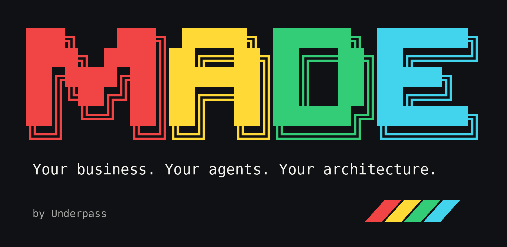

# MADE plugin



The MADE bundle gives Codex and Claude Code setup, design and execution skills
plus one local MCP server backed by SQLite. The host supplies the agents and
tools; MADE coordinates their claims, results and human decisions.

## Install the current stable release

**These stable routes require the 0.6.0 assets to be public and `marketplace`
to have advanced to that release.** The old v0.5.0 marketplace snapshot is
named `underpass` and cannot provide `made@made`.

This checkout's `0.7.0-rc.1` manifest is a source candidate. It does not make
0.7.0-rc.1 a published release or move the stable catalogue away from 0.6.0.
Use the candidate route below until matching assets and catalogue pointers are
published.

```bash
codex plugin marketplace add underpass-ai/made --ref marketplace
codex plugin add made@made
```

```text
/plugin marketplace add underpass-ai/made@marketplace
/plugin install made@made
/made:setup
```

After publication, run `made-setup` in Codex or `/made:setup` in Claude Code,
then start a new task. The
[installation guide](https://github.com/underpass-ai/made/blob/main/docs/plugins/README.md)
covers registration and migration from the old catalogue.

## Test a candidate before publication

Build the reviewed checkout using the
[source instructions](https://github.com/underpass-ai/made/blob/main/docs/embedded/README.md#test-a-source-candidate).
Set `MADE_MCP_BIN` to its absolute executable path in the host launch
environment. Codex can then register that checkout's local `made` catalogue:

```bash
codex plugin marketplace add /absolute/path/to/made
codex plugin add made@made
```

The setup skill verifies that the explicit candidate matches this checkout's
manifest instead of downloading an asset that does not exist yet. Claude's
catalogue source pins the immutable release tag; before that tag exists, use
manual MCP registration with the source-built binary or this checkout's
launcher and `MADE_MCP_BIN`. Do not present that candidate as an installed or
downloaded stable release.

## Runtime

Release setup verifies and installs the binary matching the manifest version in the
plugin's `bin/` directory. The launcher honors `MADE_MCP_BIN`, then uses the
plugin-local executable or a PATH fallback. `MADE_MCP_STORE_PATH` selects the
SQLite file. On POSIX the default is
`${XDG_STATE_HOME:-$HOME/.local/state}/underpass-made/ceremonies.sqlite3`;
on native Windows it is `%LOCALAPPDATA%\underpass-made\ceremonies.sqlite3`
(with a `%USERPROFILE%\.local\state` fallback if `LOCALAPPDATA` is absent).
A catalogue rename does not rename that data directory.

Embedded startup also requires `MADE_AUTH_POLICY_ID` and
`MADE_AUTH_TRUSTED_HOST_ID` in the MCP launch environment. Before the first
start, bootstrap that exact store explicitly:

```bash
made-mcp bootstrap-authorization "$MADE_MCP_STORE_PATH" \
  --policy-id "$MADE_AUTH_POLICY_ID" \
  --trusted-host-id "$MADE_AUTH_TRUSTED_HOST_ID"
```

Bootstrap is idempotent for the same values. It creates the administrative
owner boundary; business capabilities still require explicit grants. The
launcher refuses missing authorization configuration and never creates an
anonymous owner or a replacement store.

The included `.mcp.json` points to `scripts/run-embedded-mcp.sh`. On native
Windows without Bash, replace that command in the existing `made` MCP
registration with the plugin's absolute `scripts\run-embedded-mcp.cmd` path
(or invoke it through `cmd.exe /d /c` if required by the host). Installing the
EXE alone is not enough. Keep one MADE registration and recheck the command
after updates. The [setup skill](skills/made-setup/SKILL.md) includes this
platform step.

In a fresh task, use `made_discover_capabilities` and `made_get_help` to
inspect the actual running version/backend. `tools/list` is the authority for
request schemas. Publish definitions before starting resumable sessions.
No-op handler success proves protocol wiring only. For delegated work,
retain the accepted claim response, perform the real work and complete using
its exact identity. Version 0.6.0 requires `claim_fence` on completion;
v0.5.0 predates that boundary, so inspect the running schema.

The skills are self-contained inside the bundle:
[setup](skills/made-setup/SKILL.md),
[design](skills/design-ceremony/SKILL.md) and
[run](skills/run-ceremony/SKILL.md).
Repository guides describe [runtime semantics](https://github.com/underpass-ai/made/blob/main/docs/runtime/README.md)
and [validation](https://github.com/underpass-ai/made/blob/main/docs/development/README.md).
